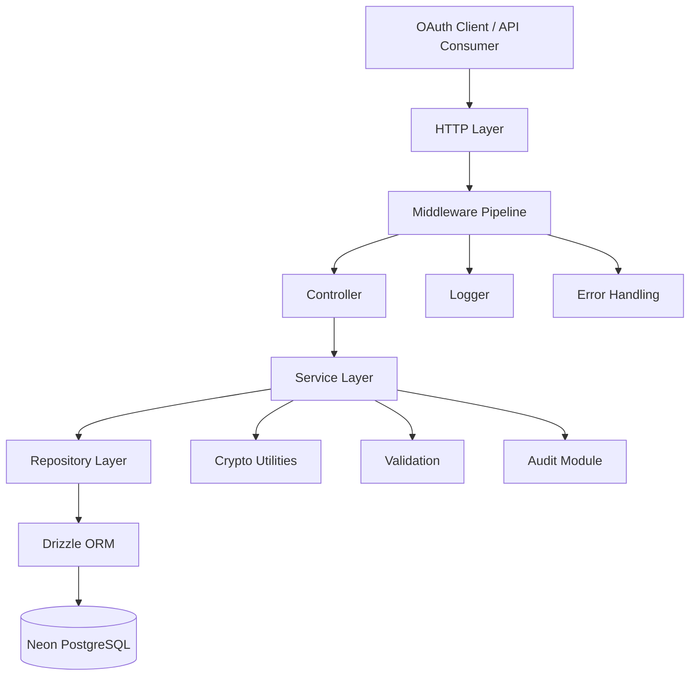
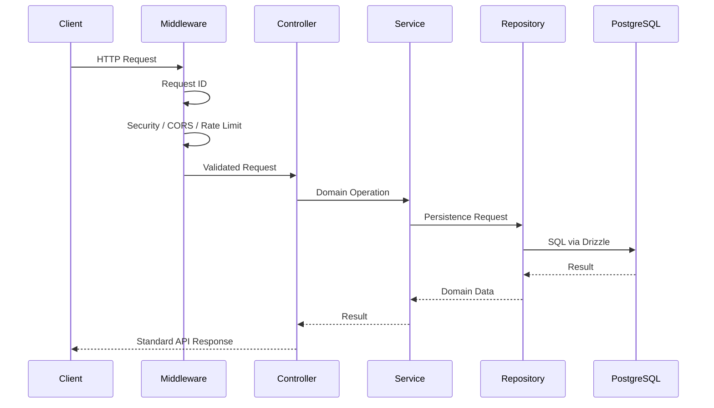

# AuthForge — Project Overview

**Project:** AuthForge  
**Version:** 0.1.0  
**Type:** Production-oriented OAuth 2.1 and OpenID Connect Authorization Server  
**Runtime:** Node.js 22+  
**Language:** TypeScript 5.9.2  
**Module System:** ESM  
**Package Manager:** pnpm 10.21+  
**Framework:** Express 5  
**Database:** PostgreSQL / Neon  
**ORM:** Drizzle ORM

---

## 1. What Is AuthForge?

AuthForge is a backend authorization and identity platform being built around the OAuth 2.1 and OpenID Connect ecosystem.

Its primary responsibility is to provide the infrastructure required to:

- register OAuth clients
- authenticate users
- manage sessions
- authorize clients to access user resources
- handle OAuth authorization flows
- enforce PKCE
- issue and manage tokens
- persist user consent
- expose OpenID Connect functionality
- expose signing keys through JWKS
- record security-relevant audit events

The project is being developed as a real-world backend system rather than as a minimal tutorial implementation.

The design therefore prioritizes:

```text
Security
Correctness
Separation of concerns
Maintainability
Observability
Database integrity
Protocol compliance
```

---

# 2. Project Goal

The goal is to build an authorization server with a clean internal architecture that can evolve from the current foundation into a complete OAuth 2.1 / OIDC implementation.

The project is not being structured around individual endpoints alone.

Instead, the system is organized around domain responsibilities:

```text
Developer
Client
User
Session
Authorization
Consent
Token
OAuth
OIDC
JWKS
Audit
```

This makes it possible to implement protocol behavior without allowing HTTP controllers, database access, cryptography, and business logic to become tightly coupled.

---

# 3. Technology Foundation

AuthForge currently uses the following foundation:

| Area | Technology |
|---|---|
| Runtime | Node.js 22+ |
| Language | TypeScript 5.9.2 |
| Package manager | pnpm |
| Module system | ESM |
| HTTP framework | Express 5 |
| Database | PostgreSQL |
| Hosted database | Neon |
| ORM | Drizzle ORM |
| Validation | Zod |
| Logging | Pino |
| HTTP logging | pino-http |
| Security headers | Helmet |
| CORS | cors |
| Environment configuration | dotenv + centralized env validation |
| Development runner | tsx |
| Build | TypeScript + tsc-alias |
| Linting | ESLint |
| Formatting | Prettier |

The project uses a strict TypeScript-oriented development approach and keeps runtime configuration centralized.

---

# 4. High-Level Architecture

The application follows a layered/domain-oriented backend structure.



The important dependency direction is:

```text
HTTP
 ↓
Controller
 ↓
Service
 ↓
Repository
 ↓
Database
```

Business logic should not be placed directly inside controllers or database schema files.

---

# 5. Source Tree

The current `src` structure is:

```text
src/
│
├── app.ts
├── server.ts
│
├── common/
│   ├── config/
│   │   ├── env.ts
│   │   ├── index.ts
│   │   └── schema.ts
│   │
│   ├── constants/
│   │
│   ├── crypto/
│   │
│   ├── db/
│   │   ├── connection.ts
│   │   ├── index.ts
│   │   └── schema/
│   │       ├── audit-log.ts
│   │       ├── authorization.ts
│   │       ├── client-grant-type.ts
│   │       ├── client-redirect-uri.ts
│   │       ├── client-scope.ts
│   │       ├── client.ts
│   │       ├── consent.ts
│   │       ├── developer.ts
│   │       ├── enums.ts
│   │       ├── helper.ts
│   │       ├── index.ts
│   │       ├── session.ts
│   │       ├── token.ts
│   │       └── user.ts
│   │
│   ├── errors/
│   │   ├── api-error.ts
│   │   ├── error-codes.ts
│   │   ├── error-handler.ts
│   │   └── index.ts
│   │
│   ├── logger/
│   │   ├── index.ts
│   │   └── logger.ts
│   │
│   ├── middleware/
│   │   ├── cors.ts
│   │   ├── index.ts
│   │   ├── not-found.ts
│   │   ├── rate-limit.ts
│   │   ├── request-id.ts
│   │   ├── request-logger.ts
│   │   └── security.ts
│   │
│   ├── types/
│   │   └── express.d.ts
│   │
│   ├── utils/
│   │   └── response.ts
│   │
│   └── validation/
│
└── modules/
    ├── audit/
    ├── auth/
    ├── client/
    ├── consent/
    ├── developer/
    ├── health/
    │   ├── health.controller.ts
    │   ├── health.routes.ts
    │   ├── health.service.ts
    │   ├── health.types.ts
    │   └── index.ts
    │
    ├── jwks/
    ├── oauth/
    ├── oidc/
    ├── session/
    ├── token/
    └── user/
```

This tree is the current structural source for the project overview.

---

# 6. `common` vs `modules`

One of the most important architectural decisions is the separation between:

```text
common/
modules/
```

## `common/`

`common` contains infrastructure and reusable application capabilities.

Examples:

```text
config
crypto
database
errors
logger
middleware
types
utils
validation
```

These are not tied to one business domain.

For example:

```text
request-id middleware
```

can be used by:

```text
auth
client
oauth
oidc
health
token
```

Therefore it belongs in `common`.

---

## `modules/`

`modules` contains business/domain functionality.

Examples:

```text
client
developer
user
session
oauth
oidc
token
consent
audit
```

These modules answer domain-specific questions.

For example:

```text
client module
    → How are OAuth clients registered?

token module
    → How are tokens issued/revoked?

consent module
    → How is user permission persisted?

oauth module
    → How is the OAuth protocol flow handled?
```

This boundary prevents generic infrastructure from becoming mixed with business rules.

---

# 7. Domain Modules

The current module layout identifies the major domains of AuthForge.

## Developer

Responsible for the developer/application-owner side of the platform.

Conceptually:

```text
Developer
    ↓
Client Registration
```

A developer can own multiple OAuth clients.

---

## Client

Responsible for OAuth client registration and configuration.

The database model includes:

```text
clients
client_redirect_uris
client_scopes
client_grant_types
```

Therefore the client domain controls:

```text
client identity
redirect URI configuration
allowed scopes
supported grant types
```

---

## User

Represents the end-user/resource-owner identity used by the authorization server.

The user domain is separate from developers because these actors have different responsibilities.

```text
Developer
    → manages clients

User
    → authenticates
    → grants consent
```

---

## Auth

The `auth` module represents authentication-related application behavior.

Its responsibility is distinct from the OAuth protocol itself.

```text
Authentication
    ≠
Authorization
```

Authentication establishes who the user is.

Authorization determines what the client may receive.

---

## Session

The session domain manages persistent authenticated-user sessions.

The database stores a hashed session credential rather than a directly usable raw session token.

---

## OAuth

The OAuth module contains protocol-level authorization behavior.

Its eventual responsibility includes flows such as:

```text
Authorization endpoint
Token endpoint
PKCE verification
Authorization-code lifecycle
Token issuance
```

The exact implementation status of individual OAuth endpoints is intentionally tracked separately from this structural overview.

---

## OIDC

The OIDC module represents the OpenID Connect layer built on top of OAuth.

Its purpose is to provide identity information in addition to authorization.

---

## JWKS

The JWKS module represents the JSON Web Key Set functionality required for exposing public signing keys.

This is particularly important for OIDC/JWT verification by relying parties.

---

## Token

The token domain owns token lifecycle behavior.

The database currently models:

```text
access tokens
refresh tokens
expiration
revocation
rotation lineage
```

---

## Consent

Consent represents persistent permission granted by a user to a client.

The important distinction is:

```text
Consent UI
    ≠
Consent persistence
```

The UI asks for permission.

The database record remembers that permission.

---

## Audit

Audit is responsible for security-relevant historical events.

This is separate from ordinary application logging.

```text
Application log
    → operational/debugging information

Audit log
    → security/business history
```

---

## Health

The health module provides application health functionality.

The current module already follows the project's domain structure:

```text
health.controller.ts
health.routes.ts
health.service.ts
health.types.ts
index.ts
```

This demonstrates the intended separation between HTTP, business/service behavior, types, and module exports.

---

# 8. Request Lifecycle

A typical request should move through the application approximately as follows:



Error handling and logging surround this lifecycle.

---

# 9. Controller Responsibility

Controllers should remain thin.

A controller should primarily:

```text
receive request
    ↓
validate/extract input
    ↓
call service
    ↓
return response
```

It should not become a place for large business algorithms.

Bad:

```text
controller
    ├── query database
    ├── hash secrets
    ├── validate OAuth rules
    ├── issue tokens
    └── construct SQL
```

Preferred:

```text
controller
    ↓
service
    ↓
repository
```

This keeps protocol/business logic independently testable.

---

# 10. Service Responsibility

The service layer owns business decisions.

Examples:

```text
Can this client use this grant type?
Is this redirect URI registered?
Is the authorization still valid?
Is PKCE valid?
Has consent been granted?
Should this token be issued?
```

These decisions belong in services/domain logic rather than raw repositories.

---

# 11. Repository Responsibility

The repository layer is responsible for persistence.

Its job is to translate domain operations into database operations.

Example:

```text
Service:
    find client by OAuth client_id

Repository:
    execute the Drizzle query
```

The service should not need to know how the SQL query is constructed.

This keeps database technology behind a persistence boundary.

---

# 12. Database Boundary

The database architecture is:

```text
Repository
    ↓
Drizzle ORM
    ↓
Neon HTTP driver
    ↓
PostgreSQL
```

The database schema is defined under:

```text
src/common/db/schema/
```

and exported through:

```text
src/common/db/schema/index.ts
```

The project uses Drizzle Kit to generate and apply migrations.

Detailed database architecture is documented separately in:

```text
11-database.md
```

---

# 13. Configuration Boundary

Configuration lives under:

```text
common/config/
```

The current configuration structure contains:

```text
env.ts
index.ts
schema.ts
```

The intended flow is:

```text
process.env
    ↓
environment schema
    ↓
validated configuration
    ↓
application
```

This prevents arbitrary direct access to environment variables throughout the application.

Instead of:

```ts
process.env.DATABASE_URL
```

everywhere, application code should consume the centralized validated configuration.

---

# 14. Error Architecture

The error subsystem contains:

```text
common/errors/
├── api-error.ts
├── error-codes.ts
├── error-handler.ts
└── index.ts
```

This establishes a centralized error model.

The intended flow is:

```text
Service throws domain/application error
        ↓
Express error handling
        ↓
Central error handler
        ↓
Standard API error response
```

This avoids every controller inventing its own error response format.

---

# 15. Logging and Observability

The project uses:

```text
Pino
pino-http
```

The logging subsystem lives under:

```text
common/logger/
```

and request logging under:

```text
common/middleware/request-logger.ts
```

The request logging design includes a request ID.

Conceptually:

```text
Incoming Request
      ↓
requestId
      ↓
HTTP Logger
      ↓
Application Logs
```

Sensitive request headers such as:

```text
Authorization
Cookie
Set-Cookie
```

are redacted from request logs.

This is particularly important for an authentication/authorization server because request logs can otherwise become credential-leak channels.

---

# 16. Middleware Architecture

The current middleware area contains:

```text
cors.ts
not-found.ts
rate-limit.ts
request-id.ts
request-logger.ts
security.ts
```

These represent cross-cutting HTTP concerns.

Conceptually:

```text
Request
   ↓
Request ID
   ↓
Security Headers
   ↓
CORS
   ↓
Rate Limiting
   ↓
Request Logging
   ↓
Routes
```

The exact registration order is an implementation detail of `app.ts` and should remain the source of truth for runtime ordering.

---

# 17. Validation

The project uses Zod for runtime validation.

Validation should happen at application boundaries.

Examples:

```text
HTTP query parameters
HTTP body
HTTP path parameters
environment variables
```

The principle is:

```text
Untrusted input
      ↓
Validate
      ↓
Typed application data
      ↓
Business logic
```

This is particularly important for OAuth because protocol parameters have strict expected formats and relationships.

---

# 18. Cryptography Boundary

The project has a dedicated:

```text
common/crypto/
```

directory.

Cryptographic operations should be centralized rather than duplicated throughout controllers and services.

Examples of sensitive values that require appropriate handling include:

```text
passwords
client secrets
session tokens
authorization codes
access tokens
refresh tokens
PKCE material
signing keys
```

The database design already follows a hash-at-rest strategy for several bearer credentials.

---

# 19. Security-First Database Philosophy

AuthForge treats credentials differently from ordinary data.

Examples:

```text
password
    → password hash

client secret
    → client secret hash

session token
    → session token hash

authorization code
    → code hash

access/refresh token
    → token hash
```

The general principle is:

> If possession of a database value would directly provide credential authority, avoid storing the raw credential when the protocol allows a hash-based representation.

This is one of the core security principles of the project.

---

# 20. OAuth Domain Model

The database and module structure represent the OAuth lifecycle approximately as:

```text
Developer
    ↓
Client
    ↓
Client Configuration
    ├── Redirect URIs
    ├── Scopes
    └── Grant Types

User
    ↓
Session
    ↓
Authorization
    ├── Redirect URI
    ├── Scope
    ├── PKCE Challenge
    └── Authorization Code
            ↓
         Token
            ├── Access
            └── Refresh
                    ↓
              Rotation
```

Consent is persistent permission associated with:

```text
User + Client
```

Audit records capture security-relevant activity across these domains.

---

# 21. Authentication vs Authorization

These concepts are deliberately separated.

## Authentication

Question:

```text
Who is the user?
```

Relevant areas:

```text
auth
user
session
```

## Authorization

Question:

```text
What may this client receive/access?
```

Relevant areas:

```text
oauth
consent
client
token
```

OIDC then extends the authorization ecosystem with identity information.

---

# 22. Architectural Principles

The project should continue following these principles.

## 22.1 Separation of concerns

Do not mix:

```text
HTTP
business logic
database access
cryptography
logging
configuration
```

into one layer.

---

## 22.2 Single responsibility

Each module/file should have a clear reason to change.

---

## 22.3 Domain-first organization

Business capabilities belong under:

```text
modules/
```

Reusable infrastructure belongs under:

```text
common/
```

---

## 22.4 Security by design

Security should not be added after implementation.

It should influence:

```text
schema
credential storage
logging
validation
middleware
OAuth flow
token lifecycle
```

from the beginning.

---

## 22.5 Explicit state

Security-sensitive lifecycles should be persisted explicitly.

Examples:

```text
expires_at
revoked_at
consumed_at
email_verified_at
```

This is preferable to relying only on implicit application state.

---

## 22.6 Database integrity

Use:

```text
foreign keys
unique constraints
indexes
enums
```

where they represent real domain invariants.

---

## 22.7 Protocol state vs configuration

The system deliberately separates:

```text
Client configuration
```

from:

```text
Authorization transaction state
```

and:

```text
Token permission state
```

This prevents later configuration changes from rewriting historical security decisions.

---

# 23. Current Foundation Status

Based on the current project structure and previously completed work:

### Foundation

```text
Node.js 22+                 ✅
pnpm                        ✅
TypeScript 5.9.2           ✅
ESM                         ✅
Express 5                   ✅
Project structure           ✅
TypeScript configuration    ✅
Path aliases                ✅
```

### Infrastructure

```text
Environment configuration    ✅
Error utility                ✅
Central error handler        ✅
Logger                       ✅
HTTP request logging         ✅
Request ID                   ✅
Security middleware          ✅
CORS                         ✅
Rate-limit middleware        ✅
Response utility             ✅
Health module                ✅
```

### Database

```text
Neon PostgreSQL              ✅
Drizzle ORM                  ✅
Drizzle Kit                  ✅
Database connection          ✅
Schema architecture          ✅
Migration configuration      ✅
Domain schema set             ✅
Database documentation       ✅
```

### Domain foundation

```text
Developer                     ✅
Client                        ✅
User                          ✅
Session                       ✅
Consent                       ✅
Authorization                 ✅
Token                         ✅
Audit                         ✅
```

### Protocol modules

```text
OAuth                         🚧
OIDC                          🚧
JWKS                          🚧
```

The module directories exist, but their presence in the source tree must not be interpreted as proof that every protocol feature inside them is already implemented.

---

# 24. Current Development Direction

The project is currently moving from:

```text
Foundation
```

toward:

```text
Domain implementation
```

The foundation has established:

```text
configuration
logging
errors
middleware
database
schemas
response handling
health
```

The next engineering work should progressively connect the domain layers:

```text
Schema
   ↓
Repository
   ↓
Service
   ↓
Controller
   ↓
Routes
   ↓
Protocol flow
```

This order prevents the application from becoming a collection of controllers containing database queries and business logic.

---

# 25. Recommended Implementation Progression

The implementation should continue approximately in this direction:

```text
1. Foundation
      ↓
2. Database schema
      ↓
3. Repository layer
      ↓
4. Developer / Client management
      ↓
5. User authentication
      ↓
6. Session management
      ↓
7. OAuth authorization endpoint
      ↓
8. Consent handling
      ↓
9. Authorization code + PKCE
      ↓
10. Token endpoint
      ↓
11. Refresh-token rotation
      ↓
12. OIDC
      ↓
13. JWKS / signing keys
      ↓
14. Audit/security hardening
      ↓
15. Testing
      ↓
16. Deployment
```

This is a roadmap, not a claim that every stage is already complete.

---

# 26. Documentation Structure

The project documentation is being maintained as separate focused documents.

Current database documentation:

```text
docs/11-database.md
```

The broader documentation plan is:

```text
docs/
│
├── 01-project-overview.md
├── 02-architecture.md
├── 03-project-structure.md
├── 04-development-conventions.md
├── 05-configuration.md
├── 06-error-handling.md
├── 07-logging.md
├── 08-api-design.md
├── 09-authentication.md
├── 10-oauth-flow.md
├── 11-database.md
├── 12-security.md
├── 13-testing.md
├── 14-migrations.md
└── 15-deployment.md
```

The documents should complement each other rather than duplicating large sections.

---

# 27. How to Read the Project

A developer joining AuthForge should understand the codebase in this order:

```text
README
   ↓
01-project-overview
   ↓
02-architecture
   ↓
03-project-structure
   ↓
04-development-conventions
   ↓
Database documentation
   ↓
Individual domain module
```

For a specific feature:

```text
Route
  ↓
Controller
  ↓
Service
  ↓
Repository
  ↓
Schema
```

This gives the developer both the request path and the persistence model.

---

# 28. What AuthForge Is Trying to Avoid

The architecture intentionally avoids a number of common backend problems.

## Fat controllers

Avoid:

```text
Controller
    ├── validation
    ├── business rules
    ├── SQL
    ├── cryptography
    └── response construction
```

---

## Direct database access everywhere

Avoid:

```text
controller → db
service → db
middleware → db
```

without a persistence boundary.

Preferred:

```text
service → repository → db
```

---

## Generic "utils" dumping ground

`common/utils` should remain small.

Domain-specific logic should live in its domain module.

---

## Shared state without ownership

Security-sensitive state should have a clear owner and lifecycle.

---

## Protocol logic mixed with infrastructure

OAuth/OIDC rules should remain in their protocol/domain layers instead of being scattered through generic middleware.

---

# 29. Architectural Mental Model

The simplest mental model for AuthForge is:

```text
                    AUTHFORGE
                        │
            ┌───────────┴───────────┐
            │                       │
        COMMON                   MODULES
     Infrastructure             Business
            │                       │
   ┌────────┼────────┐       ┌──────┼──────┐
   │        │        │       │      │      │
 Config   DB      Security  Auth  OAuth  OIDC
   │        │        │       │      │      │
   └────────┴────────┴───────┴──────┴──────┘
                        │
                     Services
                        │
                   Repositories
                        │
                     Database
```

The key rule is:

> **Infrastructure supports the domains; domains implement the product.**

---

# 30. Final Summary

AuthForge is being built as a modular, security-focused authorization server.

Its current architecture separates:

```text
Infrastructure
    ↓
Domain Modules
    ↓
Services
    ↓
Repositories
    ↓
Database
```

The system is designed around OAuth/OIDC security concepts rather than generic CRUD alone.

The most important domain relationships are:

```text
Developer
    ↓
Client
    ↓
Authorization
    ↓
Token

User
    ↓
Session
    ↓
Authorization
    ↓
Consent

Authorization
    ↓
PKCE
    ↓
Authorization Code
    ↓
Token
    ↓
Refresh Rotation

All important security events
    ↓
Audit
```

The foundation is now strong enough to move into deeper architectural documentation and domain implementation.

The next documentation layer should explain **how these components communicate**, rather than repeating what each component is.

That document is:

```text
02-architecture.md
```
