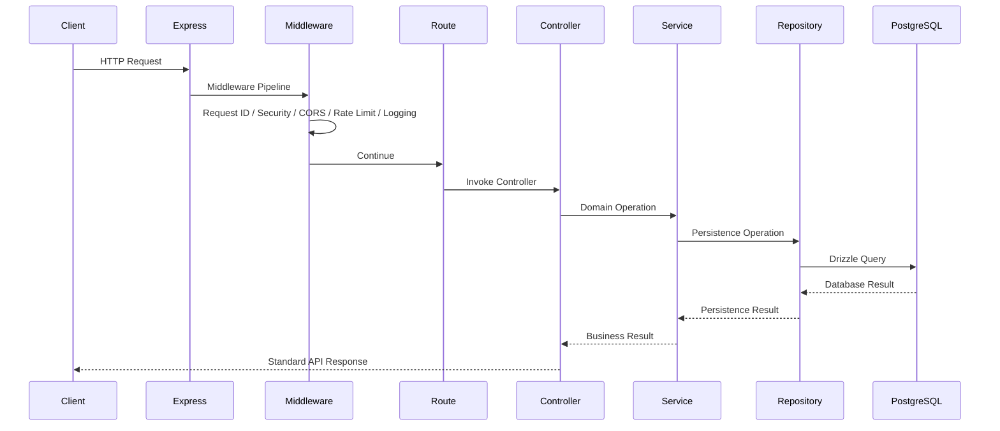
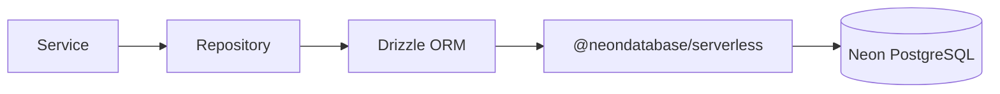
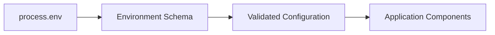
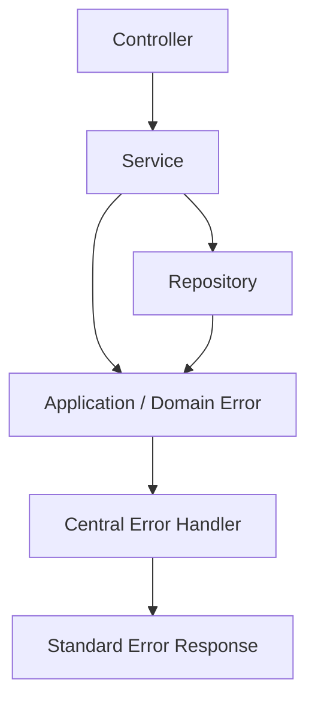
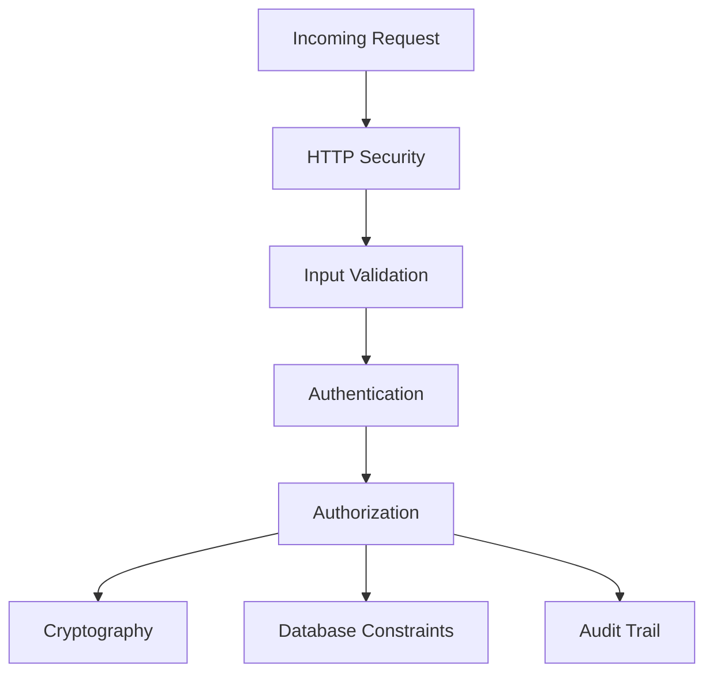
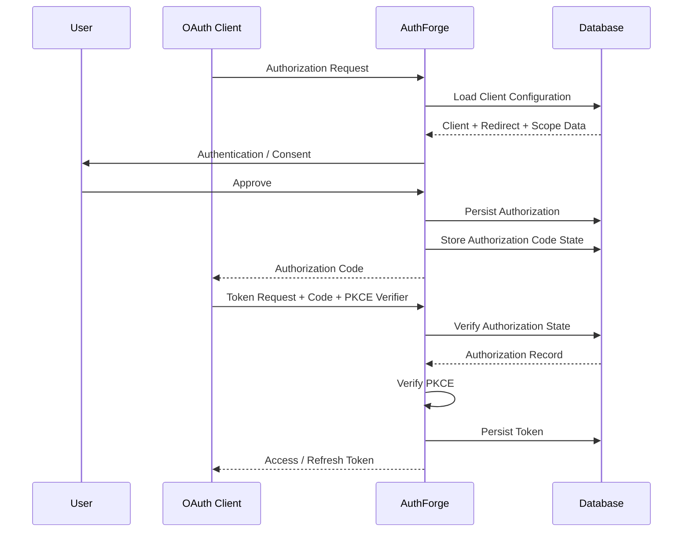
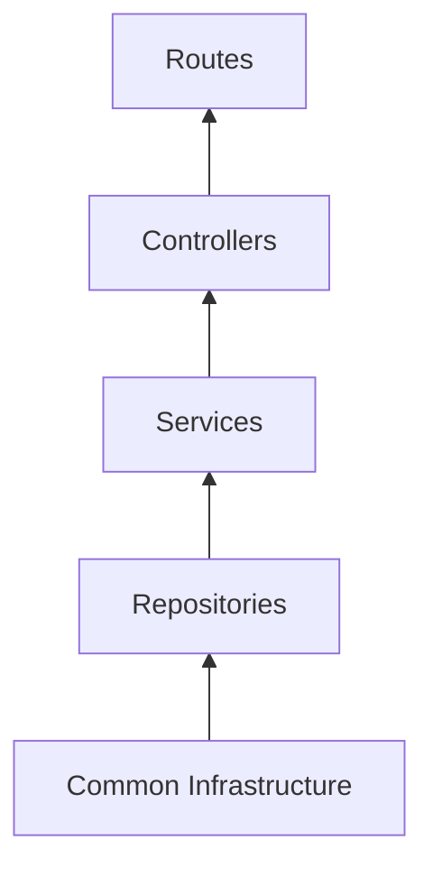

# AuthForge — Architecture

**Project:** AuthForge  
**Document:** 02 — Architecture  
**Status:** Living architectural documentation  
**Scope:** Backend architecture and internal component boundaries

---

# 1. Purpose

This document explains **how AuthForge is structured internally and how its components communicate**.

`01-project-overview.md` explains what AuthForge is.

This document explains:

```text
How a request enters the system
How it moves through the application
Where business logic lives
Where database access lives
How cross-cutting infrastructure is shared
Where security boundaries exist
What dependencies are allowed
```

The architecture is based on the current project structure:

```text
src/
├── app.ts
├── server.ts
├── common/
└── modules/
```

The architecture should evolve without destroying these boundaries.

---

# 2. Architectural Style

AuthForge uses a combination of:

- **Modular architecture**
- **Layered application flow**
- **Domain-oriented organization**
- **Repository pattern**
- **Centralized cross-cutting infrastructure**
- **Security-oriented boundaries**

The core request path is:

```text
HTTP Request
     ↓
Middleware
     ↓
Controller
     ↓
Service
     ↓
Repository
     ↓
Database
```

Supporting infrastructure surrounds this path:

```text
Configuration
Validation
Cryptography
Logging
Error handling
Security middleware
Response utilities
```

---

# 3. High-Level Architecture

````mermaid
flowchart TD
    Client["Client / Browser"]

    subgraph Infrastructure["Cross-Cutting Infrastructure"]
        Security["Security Middleware"]
        CORS["CORS"]
        RequestID["Request ID"]
        RateLimit["Rate Limiting"]
        RequestLogger["Request Logger"]
        ErrorHandler["Error Handler"]
    end

    subgraph Application["Application Layer"]
        Routes["Routes<br/>(Functions)"]
        Controller["Controller<br/>(Classes)"]
        Service["Service<br/>(Classes)"]
    end

    subgraph Persistence["Persistence Layer"]
        Repository["Repository<br/>(Classes)"]
        Drizzle["Drizzle ORM"]
        PostgreSQL[("PostgreSQL")]
    end

    Client --> Security
    Security --> CORS
    CORS --> RequestID
    RequestID --> RateLimit
    RateLimit --> RequestLogger
    RequestLogger --> Routes

    Routes --> Controller
    Controller --> Service
    Service --> Repository
    Repository --> Drizzle
    Drizzle --> PostgreSQL

    ErrorHandler -. handles errors .-> Controller
    ErrorHandler -. handles errors .-> Service
    ErrorHandler -. handles errors .-> Repository

    ```

The important architectural principle is:

> **Business domains depend on infrastructure capabilities, but infrastructure should not contain business-specific rules.**


``` mermaid

````

---

# 4. Application Bootstrap

The application has two important entry points:

```text
src/server.ts
src/app.ts
```

They represent different responsibilities.

---

## 4.1 `server.ts`

The server entry point is responsible for starting the HTTP server.

Conceptually:

```text
server.ts
    ↓
create application
    ↓
listen on configured port
```

It should not become a place for domain business logic.

---

## 4.2 `app.ts`

`app.ts` represents the Express application composition layer.

It is responsible for assembling:

```text
middleware
routes
error handling
not-found handling
```

Conceptually:

```text
app.ts
 ├── security middleware
 ├── request infrastructure
 ├── routes
 ├── 404 handling
 └── centralized error handling
```

This keeps application composition separate from server startup.

---

# 5. Request Lifecycle

A normal request follows this general path:



Not every request necessarily uses every component.

For example, a simple health endpoint may not need a repository.

---

# 6. Middleware Pipeline

Middleware handles concerns that apply across multiple routes.

Current middleware structure:

```text
common/middleware/
├── cors.ts
├── index.ts
├── not-found.ts
├── rate-limit.ts
├── request-id.ts
├── request-logger.ts
└── security.ts
```

These components exist outside individual business modules because they are application-wide concerns.

---

## 6.1 Request ID

The request ID gives an incoming request a correlation identifier.

Conceptually:

```text
HTTP Request
      ↓
Request ID
      ↓
Every related log entry
```

This makes it possible to trace:

```text
request
   ↓
controller
   ↓
service
   ↓
database operation
   ↓
error
```

through logs.

---

## 6.2 Security Middleware

Security middleware provides HTTP-level security controls.

It belongs in `common/middleware` because it applies across the application rather than one domain.

---

## 6.3 CORS

CORS policy is HTTP infrastructure.

It should not be duplicated inside individual controllers.

---

## 6.4 Rate Limiting

Rate limiting is a cross-cutting protection mechanism.

It can protect authentication and authorization endpoints from abuse.

The exact limits should remain configuration/domain policy rather than being scattered through controllers.

---

## 6.5 Request Logging

Request logging belongs to infrastructure.

Business modules should not need to implement their own HTTP request logger.

---

# 7. Route Boundary

Routes translate an HTTP endpoint into a controller operation.

Conceptually:

```text
HTTP method + path
        ↓
Route
        ↓
Controller
```

Example:

```text
POST /clients
    ↓
client route
    ↓
client controller
```

Routes should primarily define:

```text
HTTP method
path
middleware
controller handler
```

They should not contain large business algorithms.

---

# 8. Controller Layer

Controllers are the HTTP-facing part of a business module.

Their responsibility is to translate between:

```text
HTTP
```

and:

```text
Application/domain operations
```

A controller should generally:

1. Read request data.
2. Validate or invoke validation.
3. Call the appropriate service.
4. Convert the service result into the standard API response.
5. Allow errors to reach centralized error handling.

Conceptually:

```text
Request
  ↓
Controller
  ↓
Service
  ↓
Response
```

---

## 8.1 What Controllers Should Not Do

Controllers should not become responsible for:

```text
raw SQL
large database queries
token generation algorithms
password hashing
OAuth protocol state machines
complex authorization decisions
transaction-heavy business logic
```

Those responsibilities belong in lower layers or specialized infrastructure.

---

# 9. Service Layer

The service layer contains business operations.

This is where application rules should be orchestrated.

Example:

```text
ClientService.createClient()
```

might coordinate:

```text
validate client input
    ↓
check developer ownership
    ↓
generate credential material
    ↓
persist client
    ↓
persist redirect URIs
    ↓
persist scopes
    ↓
record audit event
    ↓
return result
```

The controller should not have to know how these operations are coordinated.

---

# 10. Service vs Repository

This distinction is critical.

## Service

Answers:

> **What should the application do?**

## Repository

Answers:

> **How do we persist or retrieve the required data?**

Example:

```text
Service:
    "Find an active client and verify that it owns this redirect URI."

Repository:
    "Execute the query that retrieves the client and its configuration."
```

The service owns the rule.

The repository owns persistence.

---

# 11. Repository Layer

The repository is the persistence boundary.

The intended flow is:

```text
Service
   ↓
Repository
   ↓
Drizzle
   ↓
PostgreSQL
```

Repositories should encapsulate database operations.

They should not become a second service layer.

---

## 11.1 Repository Responsibilities

Repositories may handle:

```text
SELECT
INSERT
UPDATE
DELETE
JOIN
transaction persistence operations
database-specific query composition
```

Repositories return data needed by the service layer.

---

## 11.2 Repository Responsibilities They Should Avoid

Repositories should not decide high-level business policy such as:

```text
whether a client is authorized
whether consent should be granted
whether an OAuth request is valid
whether a token should be issued
```

Those decisions belong to services/domain logic.

---

# 12. Database Boundary

AuthForge uses:

```text
Drizzle ORM
+
Neon PostgreSQL
```

The persistence flow is:



The database schema itself lives under:

```text
src/common/db/schema/
```

This is infrastructure because schema definitions describe persistence structure.

The business rules that use that data remain in domain services.

---

# 13. Why Database Schemas Are in `common`

The schema files are currently located at:

```text
common/db/schema/
```

This is intentional as part of the project's current architecture.

The database schema is a shared persistence model consumed by multiple modules:

```text
developer
client
user
oauth
consent
token
session
audit
```

Moving individual tables into every business module could create fragmentation and make the complete relational model harder to understand.

The trade-off is that the database schema directory is not a pure domain boundary.

Therefore:

```text
Schema files
    → persistence definition

Services
    → domain behavior
```

must remain conceptually separate.

---

# 14. Configuration Architecture

Configuration is centralized under:

```text
common/config/
├── env.ts
├── index.ts
└── schema.ts
```

The intended flow is:



The important rule is:

> Application code should consume validated configuration instead of independently parsing environment variables everywhere.

---

# 15. Validation Boundary

AuthForge uses Zod for runtime validation.

Untrusted data enters at boundaries:

```text
HTTP body
HTTP query
HTTP params
environment variables
```

The flow is:

```text
Untrusted Input
      ↓
Runtime Validation
      ↓
Typed Data
      ↓
Business Logic
```

This is especially important for OAuth because protocol parameters have strict requirements.

---

# 16. Error Architecture

The current error infrastructure is:

```text
common/errors/
├── api-error.ts
├── error-codes.ts
├── error-handler.ts
└── index.ts
```

The architecture is:



The purpose is to prevent every endpoint from inventing a different error format.

---

# 17. Error Propagation

The preferred model is:

```text
Low-level operation
      ↓
throw / propagate meaningful error
      ↓
central error handler
      ↓
HTTP response
```

Controllers should not repeatedly implement:

```text
try/catch
status selection
error serialization
```

unless a specific local recovery action is genuinely required.

---

# 18. Logging Architecture

Logging is centralized under:

```text
common/logger/
├── index.ts
└── logger.ts
```

HTTP request logging is handled by middleware.

The conceptual flow is:

```text
Request
   ↓
Request ID
   ↓
HTTP Logger
   ↓
Service Logs
   ↓
Error Logs
```

Security-sensitive credentials should never be written to logs.

Particularly sensitive values include:

```text
Authorization
Cookie
Set-Cookie
client secrets
access tokens
refresh tokens
session tokens
authorization codes
```

---

# 19. Application Logging vs Audit Logging

These systems serve different purposes.

## Application logging

Used for:

```text
debugging
operations
performance investigation
errors
request tracing
```

Located under:

```text
common/logger/
```

## Audit logging

Used for:

```text
security history
authentication events
authorization events
credential lifecycle events
administrative activity
```

Located as a domain module:

```text
modules/audit/
```

and persisted in the audit database model.

The distinction is:

```text
Logs explain what the system experienced.

Audit records explain what security-relevant action occurred.
```

---

# 20. Cryptography Boundary

Cryptographic functionality is isolated under:

```text
common/crypto/
```

This prevents cryptographic operations from being duplicated across services.

The boundary is especially important for:

```text
password hashing
secret hashing
token hashing
authorization-code hashing
secure random values
signing
verification
PKCE operations
```

The exact implementation of each operation belongs to the crypto module and its consumers.

---

# 21. Security Boundary

Security exists at multiple layers.



Security is therefore not treated as one middleware file.

It is a property of the whole architecture.

---

# 22. Authentication Boundary

Authentication answers:

```text
Who is this user?
```

Relevant domains:

```text
auth
user
session
```

The authentication subsystem establishes a trusted user identity.

After authentication, authorization logic can use that identity.

---

# 23. Authorization Boundary

Authorization answers:

```text
What is this client allowed to do?
```

Relevant domains include:

```text
client
oauth
consent
token
```

A simplified flow is:

```text
User Identity
      +
Client Identity
      +
Requested Scope
      +
Registered Redirect URI
      +
Authorization Rules
      ↓
Authorization Decision
```

---

# 24. OAuth Architecture

OAuth is a protocol layer rather than simply a CRUD module.

A simplified authorization flow is:



The exact endpoint implementation is tracked separately from this architectural model.

---

# 25. PKCE Boundary

PKCE protects the authorization-code flow against interception.

The conceptual relationship is:

```text
Client creates:

code_verifier
      ↓
transform
      ↓
code_challenge
```

The authorization request carries:

```text
code_challenge
code_challenge_method
```

The token request carries:

```text
code_verifier
```

The authorization server then verifies:

```text
transform(code_verifier)
        ==
stored code_challenge
```

PKCE verification belongs to OAuth/domain logic supported by cryptographic utilities.

---

# 26. OIDC Architecture

OIDC builds identity semantics on top of OAuth.

The architectural relationship is:

```text
OAuth
  ↓
Authorization
  ↓
Tokens
  ↓
OIDC Identity Layer
```

The OIDC module should not duplicate OAuth infrastructure unnecessarily.

Instead, it should reuse the established authorization/token/security boundaries.

---

# 27. JWKS Architecture

JWKS belongs to the cryptographic identity boundary.

The conceptual flow is:

```text
Private Signing Key
       ↓
Token / ID Token Signing

Public Key
       ↓
JWKS Endpoint
       ↓
Relying Party Verification
```

Private signing material must remain protected.

Public verification material can be exposed through the JWKS endpoint.

---

# 28. Module Dependency Direction

A useful dependency model is:



In practical terms:

```text
Routes
  ↓
Controllers
  ↓
Services
  ↓
Repositories
  ↓
Database
```

And infrastructure capabilities can be consumed by the appropriate layers:

```text
config
crypto
validation
errors
logger
response
```

---

# 29. Dependency Rules

The following rules should guide future implementation.

## Rule 1 — Routes should not contain business logic

Bad:

```text
route handler
    → database query
    → OAuth validation
    → token generation
```

Preferred:

```text
route
  → controller
  → service
  → repository
```

---

## Rule 2 — Controllers should not own persistence

Bad:

```text
controller
    → db.select(...)
```

Preferred:

```text
controller
    → service
    → repository
```

---

## Rule 3 — Services should not construct raw SQL

Services should express business operations.

Repositories should implement persistence.

---

## Rule 4 — Repositories should not decide business policy

Repository:

```text
find client
```

Service:

```text
decide whether client is valid for this OAuth request
```

---

## Rule 5 — Shared infrastructure should not depend on domain modules

Avoid:

```text
common/crypto
    ↓
oauth service
```

The crypto utility may support OAuth.

But crypto should not import OAuth business logic.

---

## Rule 6 — Domain modules should not become tightly coupled

Avoid unnecessary chains such as:

```text
client → oauth → token → consent → client
```

Circular dependencies make the architecture difficult to evolve.

Shared concepts should be extracted into appropriate infrastructure or carefully defined application interfaces.

---

# 30. Module Communication

When one domain needs another domain, prefer explicit service-level interaction.

Example:

```text
OAuth Service
    ↓
Client Service
    ↓
Client Repository
```

rather than:

```text
OAuth Controller
    ↓
Client Database Query
```

The first keeps domain behavior centralized.

---

# 31. Transaction Boundary

Transactions belong around operations that must succeed or fail together.

For example:

```text
Create Client
    ├── client
    ├── redirect URIs
    ├── scopes
    └── grant types
```

If these records represent one logical operation, partial persistence can create invalid state.

The service layer should therefore coordinate transactional operations while repositories provide the persistence primitives required to execute them.

---

# 32. Database Constraints as a Second Line of Defense

Business validation happens in application logic.

Database constraints protect the data even if application logic fails.

Examples include:

```text
PRIMARY KEY
FOREIGN KEY
UNIQUE
NOT NULL
CHECK
INDEX
```

The architecture therefore uses two levels of protection:

```text
Application rules
      +
Database invariants
```

Neither should be treated as a replacement for the other.

---

# 33. API Response Boundary

The project has:

```text
common/utils/response.ts
```

This exists to keep API responses consistent.

The conceptual flow is:

```text
Service Result
      ↓
Controller
      ↓
Response Utility
      ↓
HTTP Response
```

This avoids each controller inventing a different response structure.

---

# 34. Health Module as a Reference Module

The current health module contains:

```text
health.controller.ts
health.routes.ts
health.service.ts
health.types.ts
index.ts
```

This provides a useful example of the intended module decomposition.

Conceptually:

```text
health.routes
      ↓
health.controller
      ↓
health.service
```

The database is not required for every module.

This demonstrates that the architecture is about responsibility boundaries rather than forcing every feature into an identical file set.

---

# 35. Common vs Domain Code Decision Rule

When creating a new file, ask:

> Is this capability generic infrastructure or business behavior?

If it is generic:

```text
common/
```

If it expresses a domain rule:

```text
modules/<domain>/
```

Examples:

```text
JWT signing primitive
    → common/crypto

OAuth authorization decision
    → modules/oauth

Database connection
    → common/db

Client registration rule
    → modules/client

Environment validation
    → common/config

Consent decision
    → modules/consent
```

---

# 36. Where New Code Should Go

Use this decision table:

| Requirement                   | Location            |
| ----------------------------- | ------------------- |
| Environment variable handling | `common/config`     |
| Database connection           | `common/db`         |
| Database schema               | `common/db/schema`  |
| Cryptographic primitive       | `common/crypto`     |
| Global error type             | `common/errors`     |
| Global middleware             | `common/middleware` |
| Generic validation helper     | `common/validation` |
| API response helper           | `common/utils`      |
| OAuth business rule           | `modules/oauth`     |
| Client business rule          | `modules/client`    |
| User business rule            | `modules/user`      |
| Token lifecycle               | `modules/token`     |
| Consent lifecycle             | `modules/consent`   |
| Audit behavior                | `modules/audit`     |
| OIDC behavior                 | `modules/oidc`      |

---

# 37. Anti-Patterns to Avoid

## God Controller

```text
one controller
    ↓
everything
```

Avoid.

---

## God Service

A service containing every business domain is equally problematic.

Avoid:

```text
AuthForgeService
```

containing:

```text
clients
users
oauth
tokens
consents
audit
oidc
```

Prefer domain services.

---

## Database Leakage

Avoid exposing database-specific structures throughout HTTP handlers.

---

## Utility Dumping Ground

Avoid putting unrelated business logic into:

```text
common/utils
```

---

## Duplicate Security Logic

Avoid implementing credential hashing or token generation separately in multiple modules.

---

## Silent Security Failures

Security-sensitive operations should produce meaningful errors and appropriate audit records where required.

---

# 38. Architecture Evolution

The architecture should evolve incrementally.

Do not introduce abstraction simply because it looks sophisticated.

A useful rule is:

```text
Concrete need
    ↓
Repeated pattern
    ↓
Stable boundary
    ↓
Abstraction
```

This prevents premature framework-like complexity.

---

# 39. Current Architecture Maturity

The project has established the main infrastructure boundaries:

```text
Application bootstrap       ✅
Configuration               ✅
Middleware                  ✅
Error handling              ✅
Logging                     ✅
Response utility            ✅
Database                    ✅
Schema                      ✅
Domain module structure     ✅
```

The major next step is to connect these boundaries through complete domain implementations and protocol flows.

The architecture should therefore be considered:

```text
Foundation:       Strong
Domain structure: Established
OAuth/OIDC:       In progress
Production hardening: Upcoming
```

---

# 40. Architecture Checklist

## Application

- [x] Separate `server.ts` and `app.ts`
- [x] Central application composition
- [x] Domain modules
- [x] Common infrastructure

## HTTP

- [x] Request ID
- [x] Security middleware
- [x] CORS
- [x] Rate limiting
- [x] Request logging
- [x] 404 handling
- [x] Central error handling

## Application layers

- [x] Routes
- [x] Controllers
- [x] Services
- [x] Repository direction established

## Infrastructure

- [x] Environment validation
- [x] Database connection
- [x] Drizzle ORM
- [x] Logging
- [x] Error system
- [x] Response utility
- [x] Crypto boundary

## Domains

- [x] Developer
- [x] Client
- [x] User
- [x] Session
- [x] Consent
- [x] Authorization
- [x] Token
- [x] Audit
- [ ] Complete OAuth implementation
- [ ] Complete OIDC implementation
- [ ] Complete JWKS implementation

---

# 41. Architectural Mental Model

The entire backend can be remembered using this model:

```text
                  AUTHFORGE
                      │
              ┌───────┴───────┐
              │               │
           COMMON          MODULES
       Infrastructure       Domains
              │               │
       ┌──────┼──────┐   ┌────┼─────┐
       │      │      │   │    │     │
     Config  DB    Crypto Auth OAuth OIDC
       │      │      │   │    │     │
       └──────┴──────┴───┴────┴─────┘
                      │
                   Services
                      │
                 Repositories
                      │
                   Drizzle
                      │
                 PostgreSQL
```

The core principle is:

> **Infrastructure supports the domains. Domains express business rules. Repositories isolate persistence. Controllers translate HTTP.**

---

# 42. Final Architectural Rules

For future development, these rules should remain the default:

1. **Keep controllers thin.**
2. **Put business decisions in services/domain logic.**
3. **Keep database access behind repositories.**
4. **Keep generic infrastructure in `common`.**
5. **Keep business capabilities in `modules`.**
6. **Centralize cryptographic primitives.**
7. **Validate untrusted input at boundaries.**
8. **Use centralized error handling.**
9. **Use request IDs for traceability.**
10. **Never log credentials or bearer tokens.**
11. **Use database constraints to protect invariants.**
12. **Use transactions for logically atomic operations.**
13. **Avoid circular module dependencies.**
14. **Do not create abstractions without a real architectural need.**
15. **Keep OAuth/OIDC protocol rules separate from generic HTTP infrastructure.**
16. **Treat security as a property of the complete system, not one middleware.**

---

# 43. Relationship With Other Documentation

This document intentionally does not duplicate every implementation detail.

Use:

```text
01-project-overview.md
```

for:

```text
What AuthForge is
What exists
Overall roadmap
```

Use:

```text
02-architecture.md
```

for:

```text
How components communicate
Layer boundaries
Dependency direction
Request lifecycle
```

Use:

```text
03-project-structure.md
```

for:

```text
Where files belong
How modules are organized
```

Use:

```text
11-database.md
```

for:

```text
Tables
Foreign keys
Constraints
Indexes
ER diagram
Database design decisions
```

This separation keeps the documentation readable and avoids turning one document into an unmaintainable encyclopedia.

---

# 44. Closing Principle

AuthForge should remain understandable even as the number of OAuth and OIDC features increases.

The architecture exists to preserve that property.

The target is not:

```text
more folders
more abstractions
more interfaces
```

The target is:

```text
clear responsibility
predictable data flow
isolated security boundaries
testable business logic
controlled dependencies
```

That is the standard future implementations should follow.
