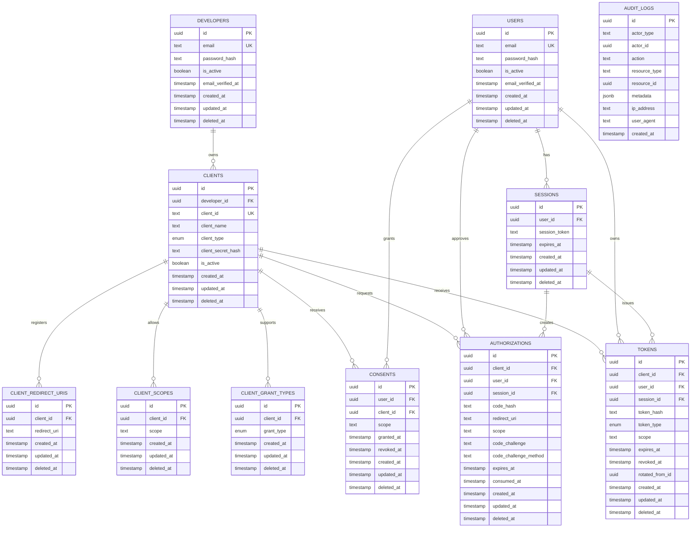

# AuthForge — Database

**Project:** AuthForge  
**Document:** 05 — Database  
**Status:** Living documentation  
**Database:** PostgreSQL  
**Provider:** Neon  
**ORM:** Drizzle ORM  
**Schema source:** `src/common/db/schema/`

> This document describes the database as it exists in the supplied AuthForge schema source. Where the source does not define a relationship or constraint, this document does not invent one.

---

# 1. Database Role

The AuthForge database stores the persistent state required by the authorization server.

The current model covers:

```text
Developers
    ↓
OAuth Clients
    ├── Redirect URIs
    ├── Scopes
    └── Grant Types

Users
    ├── Sessions
    ├── Consents
    ├── Authorizations
    └── Tokens

Audit Logs
```

The database is therefore not merely a user database. It represents the state machine behind client registration, authentication sessions, OAuth authorization, consent, and token lifecycle.

---

# 2. Technology Stack

The current database stack is:

```text
Application
    ↓
Drizzle ORM
    ↓
@neondatabase/serverless
    ↓
Neon PostgreSQL
```

The connection implementation uses:

```ts
import { drizzle } from "drizzle-orm/neon-http";
import { neon } from "@neondatabase/serverless";
```

The application database instance is created from the validated:

```text
DATABASE_URL
```

configuration.

---

# 3. Database Configuration

Current Drizzle configuration:

```ts
import "dotenv/config";

import { defineConfig } from "drizzle-kit";

export default defineConfig({
  schema: "./src/common/db/schema/index.ts",
  out: "./drizzle",
  dialect: "postgresql",
  dbCredentials: {
    url: process.env.DATABASE_URL!,
  },
});
```

Important configuration decisions:

| Setting | Value |
|---|---|
| Schema | `./src/common/db/schema/index.ts` |
| Migration output | `./drizzle` |
| Dialect | PostgreSQL |
| Credentials | `DATABASE_URL` |

The schema index exports the individual schema files so Drizzle Kit can discover the complete schema.

---

# 4. Database Code Structure

Current database structure:

```text
src/common/db/
│
├── connection.ts
├── index.ts
│
└── schema/
    ├── audit-log.ts
    ├── authorization.ts
    ├── client-grant-type.ts
    ├── client-redirect-uri.ts
    ├── client-scope.ts
    ├── client.ts
    ├── consent.ts
    ├── developer.ts
    ├── enums.ts
    ├── helper.ts
    ├── index.ts
    ├── session.ts
    ├── token.ts
    └── user.ts
```

The database connection is infrastructure.

The schema files describe persistence.

Domain repositories should sit in their corresponding business modules.

---

# 5. Primary-Key Strategy

The project uses UUID primary keys.

The shared helper is:

```ts
export function primaryKey() {
  return {
    id: uuid("id").primaryKey().defaultRandom(),
  };
}
```

Therefore each primary-key-bearing table follows:

```text
id UUID PRIMARY KEY DEFAULT random UUID
```

This avoids sequential identifiers being exposed as resource IDs.

It also makes distributed generation practical and avoids requiring a central sequence for application-generated identifiers.

---

# 6. Timestamp Strategy

The shared timestamp helper contains:

```text
created_at
updated_at
deleted_at
```

The first two are:

```text
NOT NULL
DEFAULT NOW()
```

`deleted_at` is nullable.

This gives the project a common foundation for:

```text
creation time
last modification time
soft-delete state
```

Not every table necessarily needs all three fields conceptually, but the current schema reuses the helper where appropriate.

---

# 7. Enum Strategy

The current schema defines:

## Client type

```text
public
confidential
```

## Client grant type

```text
authorization_code
refresh_token
```

The token schema additionally defines:

```text
access
refresh
```

for token type.

Using PostgreSQL enums prevents arbitrary values from entering these constrained columns.

---

# 8. Entity Relationship Diagram

The following diagram is derived from the foreign keys explicitly defined in the supplied schema.



## Important distinction

`rotated_from_id` in `tokens` is currently an indexed UUID column, but the supplied schema does **not** declare it as a foreign key.

Likewise, `audit_logs.actor_id` and `audit_logs.resource_id` are UUIDs without declared foreign-key references.

The diagram therefore does not draw those as database-enforced relationships.

---

# 9. Developer Table

Table:

```text
developers
```

Purpose:

Represents developers/platform users who register OAuth clients.

Fields:

| Field | Purpose |
|---|---|
| `id` | UUID primary key |
| `email` | Developer login/email |
| `password_hash` | Password hash |
| `is_active` | Account status |
| `email_verified_at` | Email verification timestamp |
| `created_at` | Creation timestamp |
| `updated_at` | Modification timestamp |
| `deleted_at` | Optional soft-delete timestamp |

Constraints:

```text
uq_developers_email
idx_developers_is_active
```

The email uniqueness constraint prevents duplicate developer accounts using the same email.

---

# 10. Client Table

Table:

```text
clients
```

Purpose:

Represents registered OAuth applications.

Relationship:

```text
developers
    1
    │
    └──── N clients
```

The important foreign key is:

```text
clients.developer_id
    →
developers.id
```

with:

```text
ON DELETE CASCADE
ON UPDATE CASCADE
```

Fields:

| Field | Purpose |
|---|---|
| `id` | Internal UUID |
| `developer_id` | Owner developer |
| `client_id` | OAuth public client identifier |
| `client_name` | Human-readable application name |
| `client_type` | `public` or `confidential` |
| `client_secret_hash` | Hash for confidential-client secret |
| `is_active` | Client status |
| timestamps | Lifecycle metadata |

The important design distinction is:

```text
id
```

is the database identity.

```text
client_id
```

is the OAuth client identifier.

They should not be treated as the same concept.

---

# 11. Why `client_secret_hash` Is Nullable

Public clients do not have a confidential client secret in the same way confidential clients do.

Therefore:

```text
client_secret_hash
```

is nullable.

This allows the schema to represent both:

```text
public client
```

and:

```text
confidential client
```

without storing fake secrets for public clients.

The service layer must still enforce the semantic rule that the client's type and credential behavior are consistent.

---

# 12. Client Redirect URI Table

Table:

```text
client_redirect_uris
```

Relationship:

```text
clients
   1
   │
   └──── N redirect URIs
```

Foreign key:

```text
client_redirect_uris.client_id
    →
clients.id
```

Unique constraint:

```text
(client_id, redirect_uri)
```

This is important because the same client should not have duplicate redirect registrations.

Example:

```text
Client: abc123

Redirect URIs:

https://example.com/callback
https://example.com/oauth/callback
```

The database prevents the exact same URI from being inserted twice for the same client.

---

# 13. Why Redirect URIs Are a Separate Table

A client can have multiple redirect URIs.

Putting them directly into the client row as a single text field would create problems such as:

```text
comma-separated values
JSON parsing
difficult uniqueness enforcement
difficult indexing
```

A separate table provides a normalized one-to-many relationship.

More importantly for OAuth:

```text
redirect URI validation
```

can be performed against explicit registered records.

---

# 14. Client Scope Table

Table:

```text
client_scopes
```

Relationship:

```text
clients
   1
   │
   └──── N allowed scopes
```

Foreign key:

```text
client_scopes.client_id
    →
clients.id
```

Unique constraint:

```text
(client_id, scope)
```

Example:

```text
Client A
    ├── openid
    ├── profile
    └── email
```

The database prevents:

```text
Client A → email
Client A → email
```

from being duplicated.

---

# 15. Client Grant Type Table

Table:

```text
client_grant_types
```

Relationship:

```text
clients
   1
   │
   └──── N grant types
```

Foreign key:

```text
client_grant_types.client_id
    →
clients.id
```

Allowed values currently are:

```text
authorization_code
refresh_token
```

Unique constraint:

```text
(client_id, grant_type)
```

This makes grant-type support explicit per client.

---

# 16. User Table

Table:

```text
users
```

Purpose:

Represents end users/resource owners.

Fields:

```text
id
email
password_hash
is_active
email_verified_at
created_at
updated_at
deleted_at
```

Constraints:

```text
uq_users_email
idx_users_is_active
```

The user model is intentionally separate from `developers`.

The two actors have different roles:

```text
Developer
    → registers/manages applications

User
    → authenticates and grants application access
```

---

# 17. Session Table

Table:

```text
sessions
```

The supplied schema defines a foreign key:

```text
sessions.user_id
    →
users.id
```

with cascade behavior.

Conceptually:

```text
User
  1
  │
  └──── N Sessions
```

A session represents an authenticated user context.

That distinction matters during OAuth:

```text
Browser
   ↓
authenticated session
   ↓
authorization request
```

The authorization record then stores the session used during the authorization operation.

---

# 18. Consent Table

Table:

```text
consents
```

Purpose:

Stores a user's permission relationship with a client.

Relationships:

```text
users
  1
  │
  └──── N consents

clients
  1
  │
  └──── N consents
```

Foreign keys:

```text
consents.user_id
    →
users.id

consents.client_id
    →
clients.id
```

Unique constraint:

```text
(user_id, client_id)
```

Fields:

```text
scope
granted_at
revoked_at
```

---

# 19. Why Consent Must Be Persisted

The consent screen is the user interface.

The consent record is the durable security decision.

These are different things.

Without persistence, the server would not reliably know whether:

```text
User X
```

has already granted:

```text
Client Y
```

permission for:

```text
scope A
scope B
```

The page asks the question.

The database records the answer.

---

# 20. Consent Example

Suppose:

```text
User = Alice
Client = GitHub-like application
Requested scopes = profile, email
```

Alice approves.

The system records the consent relationship.

Later the application requests authorization again.

The service can inspect the existing consent instead of blindly treating every authorization request as a brand-new permission decision.

The exact re-consent policy remains a service/protocol decision; the database provides the durable state.

---

# 21. Authorization Table

Table:

```text
authorizations
```

This is one of the most security-sensitive tables.

It represents an authorization-code transaction/state.

Relationships:

```text
clients  → authorizations
users    → authorizations
sessions → authorizations
```

Foreign keys:

```text
authorizations.client_id
    →
clients.id

authorizations.user_id
    →
users.id

authorizations.session_id
    →
sessions.id
```

All three currently use:

```text
ON DELETE CASCADE
ON UPDATE CASCADE
```

---

# 22. Authorization Fields

Important fields:

```text
code_hash
redirect_uri
scope
code_challenge
code_challenge_method
expires_at
consumed_at
```

These fields preserve the information required to validate the later authorization-code exchange.

---

# 23. Why Store `code_hash` Instead of the Raw Code

An authorization code is a credential.

Storing a hash means the database does not need to contain the raw bearer value.

Conceptually:

```text
Raw authorization code
        ↓
      hash
        ↓
   database
```

At redemption:

```text
Presented code
      ↓
    hash
      ↓
compare with stored hash
```

This reduces the impact of database disclosure.

---

# 24. Why Store the Redirect URI in Authorization State

The authorization request originally contains a redirect URI.

That value must remain associated with the authorization transaction.

The authorization record therefore stores:

```text
redirect_uri
```

This allows the later token/code exchange workflow to validate that the redirect URI being used corresponds to the authorization transaction.

This is stronger than relying only on the current client configuration.

---

# 25. PKCE Persistence

The authorization table stores:

```text
code_challenge
code_challenge_method
```

The flow is conceptually:

```text
Client
   │
   ├── code_verifier
   │
   └── code_challenge
          ↓
      Authorization
          ↓
      stored challenge
          ↓
   token exchange
          ↓
   supplied verifier
          ↓
      verification
```

The database therefore stores the challenge, not the verifier.

The verifier should remain on the client side until redemption.

---

# 26. Authorization Expiration

The authorization record contains:

```text
expires_at
```

This allows the service to reject expired authorization codes.

The database stores the lifecycle state; the service enforces the protocol behavior.

---

# 27. Authorization Consumption

The field:

```text
consumed_at
```

represents whether the authorization code has already been consumed.

Conceptually:

```text
consumed_at = NULL
    → unused

consumed_at != NULL
    → consumed
```

This supports single-use authorization-code behavior.

The service should perform the consume/check operation safely to prevent race conditions.

---

# 28. Token Table

Table:

```text
tokens
```

Relationships:

```text
clients  → tokens
users    → tokens
sessions → tokens
```

Foreign keys:

```text
tokens.client_id
    →
clients.id

tokens.user_id
    →
users.id

tokens.session_id
    →
sessions.id
```

---

# 29. Token Fields

Important fields:

```text
token_hash
token_type
scope
expires_at
revoked_at
rotated_from_id
```

Token types:

```text
access
refresh
```

The schema therefore supports separate lifecycle handling for access and refresh tokens.

---

# 30. Why Store Token Hashes

Tokens are credentials.

The database stores:

```text
token_hash
```

instead of requiring the raw token to be stored.

Conceptually:

```text
Raw token
   ↓
Hash
   ↓
Database
```

When validating:

```text
Presented token
   ↓
Hash
   ↓
lookup/verification
```

This follows the same security principle as authorization-code hashing.

---

# 31. Token Revocation

The field:

```text
revoked_at
```

allows the token to remain in the database while becoming unusable.

That is preferable to simply deleting every revoked credential because the system can retain lifecycle/audit state.

Conceptually:

```text
revoked_at = NULL
    → not revoked

revoked_at != NULL
    → revoked
```

---

# 32. Token Rotation

The schema contains:

```text
rotated_from_id
```

This records the predecessor relationship for token rotation.

However:

> The supplied schema does not currently declare `rotated_from_id` as a foreign key to `tokens.id`.

Therefore the relationship is currently application-level rather than database-enforced.

That distinction should remain explicit until the schema is deliberately changed.

---

# 33. Audit Log Table

Table:

```text
audit_logs
```

The audit table intentionally uses polymorphic fields:

```text
actor_type
actor_id

resource_type
resource_id
```

It can represent events involving different actor/resource types without creating foreign keys to every possible table.

Example:

```text
actor_type   = "developer"
actor_id     = ...

action       = "client.created"

resourceType = "client"
resourceId   = ...
```

---

# 34. Why Audit IDs Are Not Foreign Keys

The current audit model supports multiple actor/resource types.

If:

```text
actor_id
```

were a direct FK to one table, it could not cleanly reference both:

```text
users
developers
```

without additional modeling.

The current design intentionally uses:

```text
actor_type + actor_id
```

as an application-level polymorphic reference.

This gives flexibility at the cost of database-enforced referential integrity.

That is a deliberate trade-off to recognize.

---

# 35. Index Strategy

The schema creates indexes around common lookup paths.

Examples:

```text
clients.developer_id
client_redirect_uris.client_id
client_scopes.client_id
client_grant_types.client_id
authorizations.client_id
authorizations.user_id
authorizations.session_id
authorizations.expires_at
authorizations.code_hash
tokens.client_id
tokens.user_id
tokens.session_id
tokens.token_hash
tokens.expires_at
```

The purpose is to support operational queries without requiring full table scans as data grows.

---

# 36. Unique Constraints

Current important uniqueness rules include:

```text
developers.email
users.email
clients.client_id

(client_id, redirect_uri)
(client_id, scope)
(client_id, grant_type)

(user_id, client_id) for consents
```

These constraints belong in the database because they are data-integrity rules, not merely application preferences.

---

# 37. Cascade Strategy

Current explicitly defined foreign keys use:

```text
ON DELETE CASCADE
ON UPDATE CASCADE
```

Examples:

```text
developer → client
client → redirect URI
client → scope
client → grant type
user → session
user/client → consent
client/user/session → authorization
client/user/session → token
```

The consequence is important.

For example:

```text
delete client
```

can cascade into its dependent records.

Therefore destructive operations involving parent entities must be carefully controlled at the service/API level.

---

# 38. Why Cascades Are Useful

Without cascades, deleting a client could leave orphaned records:

```text
client_redirect_uris
client_scopes
client_grant_types
authorizations
tokens
consents
```

Cascades preserve referential integrity automatically.

However, cascades are not automatically "safe." They make the parent deletion powerful.

AuthForge should therefore use explicit authorization and lifecycle rules before allowing destructive parent operations.

---

# 39. Soft Delete vs Cascade

The schema contains:

```text
deleted_at
```

on many entities while also using cascade relationships.

These serve different purposes.

## Soft delete

```text
deleted_at
```

means:

> Keep the record but consider it logically deleted.

## Cascade

means:

> Remove dependent rows when the parent is physically deleted.

The service layer must define which lifecycle behavior is appropriate for each business operation.

---

# 40. Real Authorization Flow

A simplified authorization flow looks like:

```text
Developer registers client
        ↓
CLIENTS
        ↓
redirect URIs / scopes / grant types
        ↓
User authenticates
        ↓
SESSIONS
        ↓
OAuth authorize request
        ↓
AUTHORIZATIONS
        ↓
CONSENT
        ↓
authorization code
        ↓
token exchange
        ↓
TOKENS
```

This is the central relationship between the tables.

---

# 41. Example: Client Registration

Suppose Developer A registers:

```text
Client Name:
My Application
```

The system creates:

```text
developers
    ↓
clients
```

Then configuration is stored:

```text
client_redirect_uris
client_scopes
client_grant_types
```

Conceptually:

```text
Developer
   │
   └── Client
        ├── Redirect URI
        ├── Scope
        └── Grant Type
```

---

# 42. Example: Authorization Request

Suppose the client requests:

```text
client_id = abc
redirect_uri = https://app.example/callback
scope = openid profile
code_challenge = ...
code_challenge_method = S256
```

After validation and user interaction, the server can persist authorization state containing:

```text
client
user
session
redirect URI
scope
PKCE challenge
expiration
authorization-code hash
```

That state becomes the durable authorization transaction.

---

# 43. Example: Token Issuance

After successful authorization-code redemption:

```text
authorization
       ↓
validate:
    client
    redirect URI
    code
    expiry
    PKCE
       ↓
consume authorization
       ↓
issue token
       ↓
store token hash
```

The resulting token row references:

```text
client
user
session
```

This preserves token ownership/context.

---

# 44. Example: Refresh Token Rotation

The intended conceptual chain is:

```text
Refresh Token A
       ↓
Refresh Token B
       ↓
Refresh Token C
```

The `rotated_from_id` field can represent:

```text
B.rotated_from_id = A.id
C.rotated_from_id = B.id
```

At present this chain is not enforced by a PostgreSQL foreign key because the supplied schema defines only the UUID column and index.

If strict database-level self-referential integrity becomes necessary, that should be a deliberate future schema change.

---

# 45. Schema Design Strengths

The current design has several strong properties.

## Separation of actors

```text
developers ≠ users
```

This prevents two different security roles from being collapsed into one identity table.

## Normalized client configuration

```text
client
├── redirect URIs
├── scopes
└── grant types
```

This avoids repeating client rows.

## Security-sensitive values are hashed

```text
authorization code
token
client secret
```

The schema is designed to store hashes where appropriate.

## OAuth transaction state is explicit

The authorization table keeps:

```text
redirect URI
scope
PKCE challenge
expiration
consumption state
```

together.

## Indexes match lookup paths

The schema includes indexes around:

```text
ownership
expiration
credential hashes
relationship lookups
```

---

# 46. Important Current Limitations

The following are not assumptions; they are visible from the supplied schema.

## `rotated_from_id` has no FK

It is indexed but not database-constrained.

## Audit polymorphic IDs have no FKs

This is consistent with the polymorphic actor/resource design but means referential integrity is application-level.

## `scope` is stored as text

In:

```text
client_scopes
consents
authorizations
tokens
```

the actual scope string is not normalized into a separate global scope catalog.

This can be perfectly workable, but it means scope semantics are primarily controlled by application/protocol rules.

## `updated_at` is defaulted but not automatically maintained by PostgreSQL

The shared helper defines:

```text
updated_at DEFAULT NOW()
```

but the supplied schema does not show a database trigger that automatically changes it on every update.

Therefore application code must intentionally maintain `updated_at` when records change.

---

# 47. Migration Workflow

The project uses Drizzle Kit.

Typical workflow:

```text
Change schema
    ↓
pnpm db:generate
    ↓
Review migration
    ↓
pnpm db:migrate
```

Generated migration files live under:

```text
drizzle/
```

The migration directory should be treated as source-controlled database history.

Do not casually delete migration history after it has been applied to shared environments.

---

# 48. Migration Failure Lessons

The project previously encountered Drizzle configuration/migration issues involving:

```text
missing dialect
missing config import
missing drizzle/meta/_journal.json
Neon driver connectivity
```

The correct lesson is not to bypass the migration system.

The database workflow should remain:

```text
schema
    ↓
Drizzle Kit
    ↓
reviewed migration
    ↓
Neon PostgreSQL
```

When migration tooling fails, inspect the configuration and migration state rather than manually changing the database without recording the change.

---

# 49. Transaction Strategy

Transactions belong primarily in services when one business operation spans multiple repository calls.

Example:

```text
Client registration
    ↓
create client
    ↓
create redirect URIs
    ↓
create scopes
    ↓
create grant types
```

These should not leave the database partially configured if one operation fails.

Conceptually:

```text
BEGIN
  create client
  create redirect URIs
  create scopes
  create grant types
COMMIT
```

Failure:

```text
ROLLBACK
```

The exact Drizzle transaction implementation should remain inside the service/repository boundary established by the architecture.

---

# 50. Database Security Rules

Never store raw:

```text
passwords
client secrets
authorization codes
tokens
private keys
```

when the architecture calls for hashing or secure storage.

Never log:

```text
passwords
client secrets
access tokens
refresh tokens
authorization codes
private key material
```

Database credentials belong in environment/configuration, not source code.

---

# 51. Database Access Rule

The application architecture remains:

```text
Controller
    ↓
Service
    ↓
Repository
    ↓
Drizzle
    ↓
PostgreSQL
```

A controller should not query the database directly.

A service should not randomly issue Drizzle queries if the established repository boundary applies.

Schema files should not contain application workflows.

---

# 52. Database Design Mental Model

Remember the schema in four groups:

```text
IDENTITY
├── developers
└── users

CLIENT REGISTRATION
├── clients
├── client_redirect_uris
├── client_scopes
└── client_grant_types

AUTHORIZATION STATE
├── sessions
├── consents
└── authorizations

CREDENTIAL LIFECYCLE
└── tokens

OBSERVABILITY
└── audit_logs
```

This is the simplest mental model for the current database.

---

# 53. Complete Relationship Summary

| Parent | Child | FK | Cardinality |
|---|---|---|---|
| `developers` | `clients` | `clients.developer_id` | 1:N |
| `clients` | `client_redirect_uris` | `client_redirect_uris.client_id` | 1:N |
| `clients` | `client_scopes` | `client_scopes.client_id` | 1:N |
| `clients` | `client_grant_types` | `client_grant_types.client_id` | 1:N |
| `users` | `sessions` | `sessions.user_id` | 1:N |
| `users` | `consents` | `consents.user_id` | 1:N |
| `clients` | `consents` | `consents.client_id` | 1:N |
| `clients` | `authorizations` | `authorizations.client_id` | 1:N |
| `users` | `authorizations` | `authorizations.user_id` | 1:N |
| `sessions` | `authorizations` | `authorizations.session_id` | 1:N |
| `clients` | `tokens` | `tokens.client_id` | 1:N |
| `users` | `tokens` | `tokens.user_id` | 1:N |
| `sessions` | `tokens` | `tokens.session_id` | 1:N |

Not included as FK relationships:

```text
tokens.rotated_from_id
audit_logs.actor_id
audit_logs.resource_id
```

because the supplied schema does not declare them as foreign keys.

---

# 54. Database Checklist

Before merging a database change:

- [ ] Schema change is intentional.
- [ ] Correct table owns the new field.
- [ ] Primary key is correct.
- [ ] Foreign keys are correct.
- [ ] `ON DELETE` behavior is intentional.
- [ ] `ON UPDATE` behavior is intentional.
- [ ] Unique constraints are considered.
- [ ] Indexes match actual lookup paths.
- [ ] Sensitive values are protected.
- [ ] Nullability is intentional.
- [ ] Timestamp behavior is understood.
- [ ] Migration is generated.
- [ ] Migration is reviewed.
- [ ] Migration works against the intended Neon database.
- [ ] Repository queries match the schema.
- [ ] Transaction requirements are considered.
- [ ] Audit implications are considered.

---

# 55. Final Database Architecture

The current AuthForge database can be understood as:

```text
                    DEVELOPERS
                        │
                        │ 1:N
                        ▼
                     CLIENTS
                 ┌──────┼───────┬─────────┐
                 │      │       │         │
                 ▼      ▼       ▼         │
              REDIRECT SCOPES  GRANTS     │
                 │                      │
                 └──────────┬───────────┘
                            │
                            ▼
                         OAUTH
                       WORKFLOW
                            │
              ┌─────────────┼─────────────┐
              ▼             ▼             ▼
            USERS        SESSIONS       CONSENTS
              │             │
              └──────┬──────┘
                     ▼
               AUTHORIZATIONS
                     │
                     │ successful exchange
                     ▼
                   TOKENS

              AUDIT LOGS
          records security events
```

The database is therefore designed around the lifecycle:

```text
Developer
    ↓
Client Registration
    ↓
User Session
    ↓
Authorization
    ↓
Consent
    ↓
Authorization Code
    ↓
PKCE Verification
    ↓
Token
    ↓
Token Rotation / Revocation
    ↓
Audit
```

That lifecycle is the core reason the tables exist and why their relationships are structured this way.

---

# 56. Documentation Relationship

Current documentation chain:

```text
01-project-overview.md
        ↓
02-architecture.md
        ↓
03-project-structure.md
        ↓
04-development-conventions.md
        ↓
05-database.md
```

Together:

```text
What is AuthForge?
        ↓
How is it architected?
        ↓
Where does code belong?
        ↓
How should code be written?
        ↓
How is persistent state modeled?
```

This document should be updated whenever the actual database schema changes.
