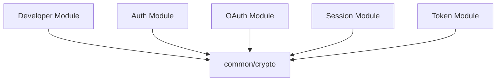
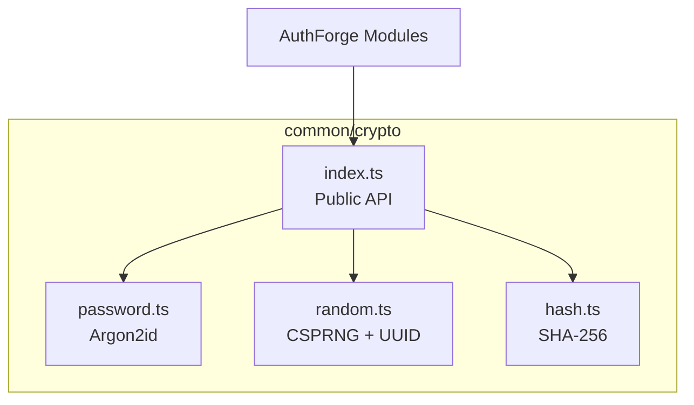

# AuthForge Crypto Layer

## 1. Overview

The `common/crypto` layer contains reusable, security-sensitive cryptographic primitives used across AuthForge.

Its purpose is to provide a small, focused boundary for:

- password hashing and verification
- cryptographically secure random value generation
- deterministic cryptographic hashing

The crypto layer is **not** a generic utility folder and should not become a dumping ground for protocol-specific authentication or authorization logic.

---

## 2. Directory Structure

```text
src/common/crypto/
├── password.ts
├── random.ts
├── hash.ts
└── index.ts
```

| File | Responsibility |
|---|---|
| `password.ts` | Password hashing and password verification |
| `random.ts` | Cryptographically secure random values and UUID generation |
| `hash.ts` | General-purpose SHA-256 hashing |
| `index.ts` | Public exports for the crypto layer |

---

# 3. Password Hashing

AuthForge uses **Argon2id** for password hashing.

Passwords must never be stored in plaintext.

### Registration

```text
Plain Password
      │
      ▼
hashPassword()
      │
      ▼
   Argon2id
      │
      ▼
Password Hash
      │
      ▼
  Database
```

### Authentication

```text
Plain Password
      │
      ▼
verifyPassword()
      │
      ▼
Stored Argon2id Hash
      │
      ▼
 true / false
```

There is no password decryption operation.

The correct model is:

```text
password → hash
password + hash → true/false
```

---

# 4. Password API

## `hashPassword()`

```ts
export async function hashPassword(
  password: string,
): Promise<string>
```

Responsibilities:

- accept a plaintext password
- hash it using Argon2id
- return the encoded password hash

The plaintext password must not be persisted or logged.

## `verifyPassword()`

```ts
export async function verifyPassword(
  password: string,
  passwordHash: string,
): Promise<boolean>
```

Responsibilities:

- accept the password supplied during authentication
- compare it with the stored Argon2id hash
- return whether the password is valid

Passwords are not decrypted.

---

# 5. Why Argon2id?

Password hashing is different from ordinary cryptographic hashing.

A general-purpose hash such as SHA-256 is designed to be fast. Fast hashing is useful for many cryptographic operations but is undesirable for password storage because attackers can perform password guesses quickly.

Argon2id is designed specifically for password hashing and is intentionally more expensive in computation and memory.

Therefore AuthForge follows:

```text
Password
   │
   ▼
Argon2id
   │
   ▼
Stored Password Hash
```

and not:

```text
Password
   │
   ▼
SHA-256
   │
   ▼
Stored Password Hash
```

---

# 6. Secure Random Values

`random.ts` uses Node.js `node:crypto` for cryptographically secure randomness.

It provides:

- random hexadecimal values
- random Base64URL values
- UUID v4 generation

Conceptually:

```text
Security-sensitive input
        │
        ▼
Node.js CSPRNG
        │
        ▼
Unpredictable value
```

Do not use:

```ts
Math.random()
```

for security-sensitive values.

---

# 7. `generateRandomHex()`

```ts
export function generateRandomHex(
  byteLength = 32,
): string
```

Generates cryptographically secure random bytes and encodes them as hexadecimal.

Use this when a hexadecimal representation is appropriate.

---

# 8. `generateRandomBase64Url()`

```ts
export function generateRandomBase64Url(
  byteLength = 32,
): string
```

Generates cryptographically secure random bytes and encodes them using Base64URL.

Base64URL is convenient for values used in:

- URLs
- HTTP headers
- protocol parameters

This primitive can be used by modules that require unpredictable values such as authorization codes or session-related secrets.

The consuming module remains responsible for the protocol or business rules around the value.

---

# 9. `generateUUID()`

```ts
export function generateUUID(): string
```

Generates a UUID v4 using:

```ts
randomUUID()
```

Use UUIDs when the application specifically requires a UUID-formatted identifier.

A UUID should not automatically replace every security-sensitive random value.

---

# 10. General Cryptographic Hashing

`hash.ts` provides SHA-256 hashing:

```ts
export function sha256(
  value: string,
): string
```

The operation is:

```text
Input
  │
  ▼
SHA-256
  │
  ▼
Deterministic Digest
```

The same input produces the same digest.

---

# 11. SHA-256 Is Not Password Hashing

This distinction is critical.

Do not use:

```ts
sha256(password)
```

for password storage.

Use:

```ts
hashPassword(password)
```

instead.

The responsibilities are different:

| Operation | Purpose |
|---|---|
| Argon2id | Password storage |
| SHA-256 | General cryptographic hashing |
| CSPRNG | Unpredictable random values |
| UUID v4 | UUID-formatted identifiers |

---

# 12. Public Crypto API

`index.ts` provides the public interface:

```ts
export {
  hashPassword,
  verifyPassword,
} from "./password.js";

export {
  generateRandomHex,
  generateRandomBase64Url,
  generateUUID,
} from "./random.js";

export { sha256 } from "./hash.js";
```

Consumers should preferably import from the public entry point:

```ts
import {
  hashPassword,
  verifyPassword,
} from "@/common/crypto/index.js";
```

This keeps consumers independent from the internal file organization.

---

# 13. Security Boundaries

The crypto layer provides reusable primitives.

It does **not** own complete authentication or authorization workflows.

```text
Password hashing
        ↓
common/crypto/password.ts

Random value generation
        ↓
common/crypto/random.ts

OAuth authorization workflow
        ↓
modules/oauth/

Token lifecycle
        ↓
modules/token/

Session behavior
        ↓
modules/session/

JWKS / key management
        ↓
modules/jwks/
```

The crypto layer may be used by these modules, but the modules own their business and protocol behavior.

---

# 14. What Does Not Belong in `common/crypto`

Do not turn the crypto directory into a collection of unrelated authentication code.

The following should remain in their respective modules:

```text
OAuth authorization-code workflow
JWT business logic
JWKS endpoints
session management
consent handling
token lifecycle
client authentication workflow
```

The architectural rule is:

> Put reusable cryptographic primitives in `common/crypto`; put application and protocol behavior in the module that owns that behavior.

---

# 15. Dependency Direction

The crypto layer is shared infrastructure.

Higher-level modules may depend on it:



The crypto layer should remain independent of business modules.

Avoid:

```text
common/crypto
      ↓
modules/developer
```

because shared infrastructure should not depend on a specific business module.

---

# 16. Developer Registration Example

A future Developer registration flow can use the crypto layer as follows:

```text
HTTP Request
     │
     ▼
Developer Controller
     │
     ▼
Developer Service
     │
     ├── validate input
     │
     ├── enforce business rules
     │
     ├── hashPassword()
     │
     ▼
Developer Repository
     │
     ▼
PostgreSQL
```

The service owns the registration workflow.

The crypto layer only performs the cryptographic operation:

```text
DeveloperService
      │
      ▼
hashPassword()
      │
      ▼
Argon2id hash
```

The repository persists the resulting hash.

---

# 17. Developer Authentication Example

Authentication can later follow:

```text
Login Request
     │
     ▼
Developer Controller
     │
     ▼
Developer Service
     │
     ├── find developer
     │
     └── verifyPassword()
             │
             ▼
       true / false
```

If verification succeeds, the appropriate authentication, session, or token workflow continues in its owning module.

The password utility does not create sessions or tokens.

---

# 18. Security Rules

## Rule 1 — Never store plaintext passwords

Only password hashes may be persisted.

## Rule 2 — Never log passwords

Passwords must never appear in:

- application logs
- request logs
- error logs
- audit logs
- database records

## Rule 3 — Do not use SHA-256 for passwords

Use the dedicated password hashing function.

## Rule 4 — Use CSPRNG for security-sensitive randomness

Do not use:

```ts
Math.random()
```

for secrets, authorization codes, session secrets, or other security-sensitive values.

## Rule 5 — Keep protocol logic outside crypto

OAuth, OIDC, token, session, and JWKS workflows belong to their respective modules.

## Rule 6 — Prefer the public crypto entry point

Use:

```ts
import { ... } from "@/common/crypto/index.js";
```

rather than coupling consumers unnecessarily to internal crypto files.

---

# 19. Package Dependency

Password hashing requires Argon2:

```bash
pnpm add argon2
```

Randomness and SHA-256 use Node.js's built-in `node:crypto`, so no additional package is required for those operations.

---

# 20. Architecture Diagram



---

# 21. Final Architecture

The crypto layer follows this model:

```text
                    common/crypto
                          │
          ┌───────────────┼───────────────┐
          │               │               │
          ▼               ▼               ▼
      password.ts     random.ts       hash.ts
          │               │               │
          ▼               ▼               ▼
       Argon2id        CSPRNG         SHA-256
```

Its purpose is intentionally narrow:

```text
Reusable cryptographic primitives
                +
Clear security boundaries
                +
No business logic
                +
No protocol workflows
```

This keeps the AuthForge crypto layer reusable while preventing authentication and authorization behavior from becoming scattered throughout shared infrastructure.
